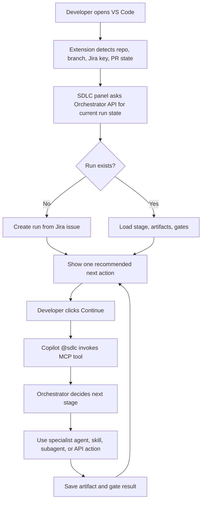
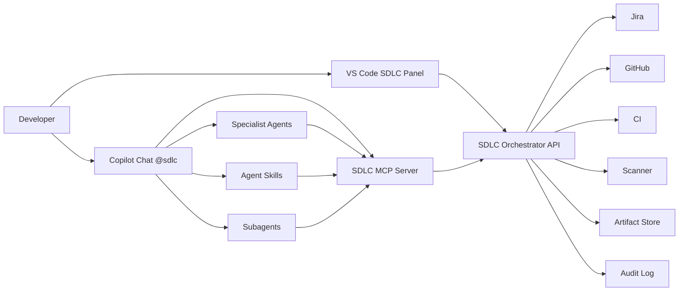
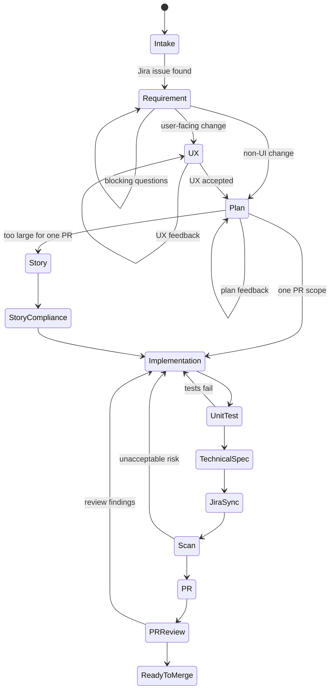
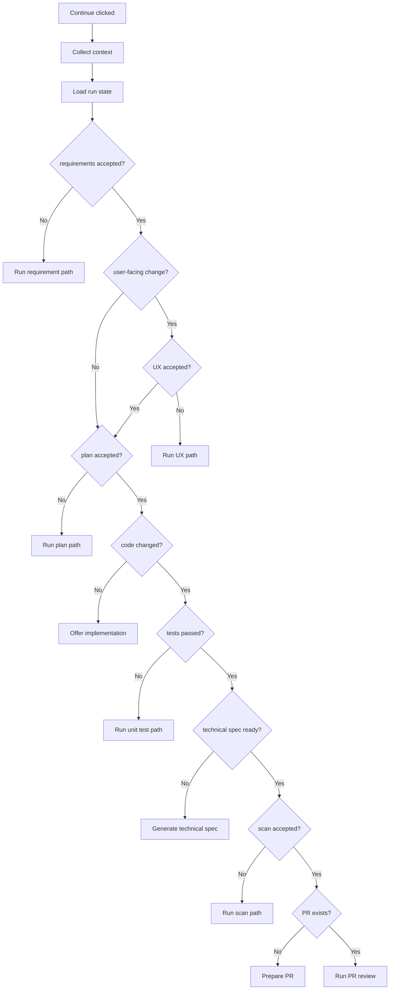

# AI-enabled SDLC Assistant Blueprint

> This document proposes a practical product and architecture shape for an internal AI-enabled SDLC system built around VS Code, GitHub Copilot, Jira, GitHub, CI, security scanning, and the existing UX agent capability.

## 一句话结论

最好的入口不是让开发者记住一堆 agent 或 slash command，而是在 VS Code 里提供一个 **SDLC Assistant**：

- 主入口：VS Code 侧边栏里的 SDLC 面板，一个默认主按钮 `Continue`
- 聊天兜底：Copilot Chat 里的 `@sdlc`
- 系统入口：SDLC MCP server 暴露给 Copilot
- 后台入口：SDLC Orchestrator API 管状态、artifact、gate、审计和外部系统集成

开发者的心智模型应该是：

```text
打开 VS Code -> 看到当前 Jira/branch/PR 的 SDLC 状态 -> 点 Continue
```

而不是：

```text
我现在该叫 requirement agent、UX agent、plan agent，还是 compliance agent？
```

## 产品原则

1. **一个默认下一步**
   大多数时候只给开发者一个主动作：`Continue`。复杂选择藏到 `View details` 里。

2. **系统驱动流程，人确认关键 gate**
   agent 可以自动收集上下文、生成草稿、跑检查；但需求接受、计划接受、回写 Jira、创建 PR、跳过 gate 这些动作需要人确认。

3. **agent 不做流程账本**
   agent 是推理和生成层，不是 source of truth。流程状态、artifact、gate、审计必须由 Orchestrator API 维护。

4. **多个 specialist agents，不暴露多个入口**
   Requirement、UX、Plan、PR Review 等可以是独立 agent；但用户只面对 SDLC Assistant。

5. **skill 是方法，agent 是角色，MCP/API 是动作**
   不要把 checklist、模板、API、角色全塞进一个大 prompt。

## 开发者看到的入口

### 入口 1：VS Code SDLC 面板

这是推荐主入口，适合日常使用。

```text
+----------------------------------------------+
| SDLC Assistant                               |
+----------------------------------------------+
| Repo: customer-web                           |
| Branch: feature/ABC-123-login-error-state    |
| Ticket: ABC-123                              |
| PR: not created                              |
|                                              |
| Current stage: Plan                          |
| Requirement: passed                          |
| UX: required, passed                         |
| Plan: missing                                |
| Tests: pending                               |
| Security scan: pending                       |
|                                              |
| Recommended next step                        |
| Create implementation plan                   |
|                                              |
| [Continue]                                   |
| [View artifacts] [Skip with reason]          |
| [Ask @sdlc]                                  |
+----------------------------------------------+
```

### 入口 2：Copilot Chat `@sdlc`

这是解释、追问、临时操作入口。

```text
@sdlc ABC-123
@sdlc check this branch
@sdlc prepare PR
@sdlc why is UX required here?
```

### 入口 3：Jira 或 GitHub 异步入口

这不是 MVP 的主入口，但适合第二阶段：

- Jira issue 上点击 `Start AI SDLC`
- GitHub PR comment 里触发 `/sdlc check`
- Orchestrator API 调 GitHub Copilot cloud agent 创建后台任务

## 推荐用户旅程



用户不需要知道背后有多少 agent。每次只需要回答：

- 这个需求草稿能不能接受？
- 这个 UX/plan 能不能接受？
- 是否允许开始改代码？
- 是否允许回写 Jira？
- 是否允许创建 PR？

## 系统架构



### 组件职责

| Component | Responsibility | Owner |
| --- | --- | --- |
| VS Code SDLC Panel | 自动识别上下文，展示状态，一个 `Continue` 主动作 | internal extension |
| `@sdlc` custom agent | 解释、路由、调用 MCP、生成人类可读输出 | `.github/agents/sdlc.agent.md` or organization agent |
| SDLC MCP Server | 把 Orchestrator API 暴露成 Copilot tools | platform team |
| SDLC Orchestrator API | source of truth：run、stage、artifact、gate、audit | platform team |
| Specialist Agents | Requirement、UX、Plan、Review 等角色化能力 | agent owners |
| Agent Skills | checklist、模板、方法论、脚本 | domain owners |
| Artifact Store | 保存 requirements、UX、plan、spec、test evidence、scan report | platform team |
| Integrations | Jira、GitHub、CI、scanner、Figma | platform team |

## 为什么需要 API，而不是只靠 agent

agent 能判断和生成，但不适合作为流程状态机。

必须有 API 的原因：

- agent 对话可能丢上下文，API 不会
- gate 结果需要审计
- Jira 回写、PR 创建、scanner 结果需要权限控制
- 多入口需要共享状态：VS Code、Jira、GitHub、后台任务都要看到同一个 run
- 流程失败后要能恢复，而不是重新问一遍

推荐 source of truth：

```text
SDLC Orchestrator API
  - run state
  - current stage
  - artifact registry
  - gate results
  - approval history
  - integration events
  - audit log
```

## Core data model

```json
{
  "runId": "sdlc_ABC-123_customer-web",
  "ticketKey": "ABC-123",
  "repo": "org/customer-web",
  "branch": "feature/ABC-123-login-error-state",
  "pullRequest": null,
  "currentStage": "plan",
  "recommendedAction": "create_implementation_plan",
  "artifacts": {
    "requirements": {
      "status": "accepted",
      "uri": "artifact://ABC-123/requirements.md"
    },
    "ux": {
      "status": "accepted",
      "uri": "artifact://ABC-123/ux.md"
    },
    "plan": {
      "status": "missing",
      "uri": null
    }
  },
  "gates": {
    "requirementReady": "passed",
    "uxReady": "passed",
    "planReady": "pending",
    "testEvidenceReady": "pending",
    "securityScanReady": "pending",
    "prReady": "pending"
  },
  "audit": [
    {
      "at": "2026-05-20T10:15:00Z",
      "actor": "user@example.com",
      "action": "accepted_requirements"
    }
  ]
}
```

## SDLC 状态机



## 阶段定义

| Stage | Trigger | Output | Gate | Human approval |
| --- | --- | --- | --- | --- |
| Intake | 识别 Jira key、repo、branch | run state | ticket linked | optional |
| Requirement | Jira 需求缺少可开发表达 | `requirements.md` | clear scope, acceptance criteria, constraints | required |
| UX | user-facing change | `ux.md`, flow, states, edge cases | flow complete, empty/error/loading states covered | required |
| Plan | requirement/UX ready | `plan.md` | file scope, approach, risk, test plan clear | required |
| Story | scope too large | `stories.md` | split by independent value and dependency | required for large work |
| Story Compliance | stories exist | `traceability.md` | every story maps to requirement and AC | required |
| Implementation | plan accepted | code changes | buildable | required before edit if autonomous |
| Unit Test | code changed | `test-evidence.md` | relevant tests pass or risk accepted | required |
| Technical Spec | implementation done | `technical-spec.md` | actual behavior captured | required before Jira sync |
| Jira Sync | spec ready | Jira update | comment/field updated | required |
| Scan | PR or branch ready | `scan-report.md` | no blocking risk or accepted exception | required for exceptions |
| PR | branch ready | PR summary | PR created with evidence | required |
| PR Review | PR exists | `review-findings.md` | findings fixed or accepted | required before merge |

## Agent、Skill、Subagent、Handoff、MCP 怎么分工

| Mechanism | Use when | Example | User sees |
| --- | --- | --- | --- |
| Custom agent | 需要稳定角色、权限边界、工具限制 | `requirement.agent.md`, `plan.agent.md` | usually hidden behind SDLC |
| Handoff | 阶段切换需要用户确认 | Requirement -> UX, Plan -> Implementation | button |
| Subagent | 独立分析、并行 review、隔离上下文 | security reviewer, test reviewer | collapsible tool call |
| Skill | 可复用方法、模板、checklist、脚本 | story compliance, technical spec writing | normally invisible |
| MCP tool | 真实动作或系统查询 | `get_jira_issue`, `save_artifact`, `create_pr` | tool confirmation if needed |
| Orchestrator API | 状态、权限、审计、集成 | `/runs/{id}/advance` | invisible |

### 推荐切法

```text
Agents:
  - sdlc-orchestrator
  - requirement
  - ux
  - plan
  - implementation
  - pr-review

Skills:
  - story-compliance
  - technical-spec-writing
  - unit-test-strategy
  - jira-update-format
  - secure-sdlc-checklist

Subagents:
  - security-reviewer
  - test-reviewer
  - architecture-reviewer
  - accessibility-reviewer

MCP tools:
  - sdlc_get_context
  - sdlc_start_run
  - sdlc_get_run
  - sdlc_advance
  - sdlc_save_artifact
  - sdlc_evaluate_gate
  - sdlc_sync_jira
  - sdlc_prepare_pr
  - sdlc_get_ci_status
  - sdlc_get_scan_status
```

## 自动化程度设计

不要一开始做完全自动驾驶。推荐 Level 2.5。

| Level | Behavior | Recommendation |
| --- | --- | --- |
| 1. Manual commands | 用户手动输入 `/requirement`, `/ux`, `/plan` | 不推荐，认知负担高 |
| 2. Guided handoff | `@sdlc` 判断下一步，用户点 handoff/continue | MVP 可用 |
| 2.5. One-button assistant | VS Code 面板自动识别上下文，用户点 `Continue` | 推荐 MVP |
| 3. Autopilot with gates | 系统自动推进低风险步骤，关键 gate 等人确认 | 第二阶段 |
| 4. Background execution | Jira/GitHub 触发后台 agent 直接开 PR | 成熟后再做 |

## Continue 按钮背后的决策逻辑



## API surface

Keep the API small. The first version should not model every future workflow.

```http
POST /v1/runs
GET  /v1/runs/{runId}
POST /v1/runs/{runId}/advance
PUT  /v1/runs/{runId}/artifacts/{artifactType}
POST /v1/runs/{runId}/gates/{gateName}/evaluate
POST /v1/runs/{runId}/approvals
POST /v1/runs/{runId}/jira/sync
POST /v1/runs/{runId}/github/pr/prepare
GET  /v1/runs/{runId}/events
```

### `POST /v1/runs/{runId}/advance`

Input:

```json
{
  "actor": "user@example.com",
  "source": "vscode-panel",
  "context": {
    "repo": "org/customer-web",
    "branch": "feature/ABC-123-login-error-state",
    "pullRequest": null,
    "changedFiles": ["src/Login.tsx", "src/Login.test.tsx"]
  }
}
```

Output:

```json
{
  "currentStage": "plan",
  "recommendedAction": {
    "id": "create_implementation_plan",
    "label": "Create implementation plan",
    "requiresApproval": false,
    "execution": {
      "kind": "agent",
      "agent": "plan",
      "promptRef": "prompt://sdlc/create-plan"
    }
  },
  "blockingQuestions": []
}
```

## MCP tools

The MCP server is a thin adapter over the API. It should not own workflow state.

```text
sdlc_start_run(ticketKey, repo, branch)
sdlc_get_run(runId)
sdlc_get_context()
sdlc_advance(runId, context)
sdlc_save_artifact(runId, artifactType, content)
sdlc_evaluate_gate(runId, gateName)
sdlc_request_approval(runId, approvalType, summary)
sdlc_sync_jira(runId)
sdlc_prepare_pr(runId)
sdlc_get_ci_status(runId)
sdlc_get_scan_status(runId)
```

## VS Code custom agent shape

`sdlc.agent.md` should be small. It should route and call tools, not contain the whole SDLC body of knowledge.

```md
---
name: sdlc
description: Orchestrate the AI-enabled SDLC workflow for the current Jira issue, branch, or PR.
tools:
  - agent
  - sdlc/*
agents:
  - requirement
  - ux
  - plan
  - implementation
  - pr-review
handoffs:
  - label: Refine Requirement
    agent: requirement
    prompt: Refine the current Jira issue into a buildable requirement artifact.
    send: false
  - label: Create UX Flow
    agent: ux
    prompt: Create or review the UX flow for this change.
    send: false
  - label: Create Plan
    agent: plan
    prompt: Create an implementation plan from the accepted requirements and UX artifacts.
    send: false
---

You are the SDLC orchestrator.

First call `sdlc_get_context` and `sdlc_get_run`.
Then decide the next required stage.

Use MCP tools for state and external systems.
Use skills for repeatable methods.
Use subagents for isolated analysis.
Use handoffs only when the developer should approve a stage transition.

Always return:
- Current stage
- Missing artifacts
- Recommended next action
- Blocking questions
- Whether human approval is required
```

## Specialist agents

### Requirement agent

Purpose:

- Convert Jira text into buildable requirements
- Identify ambiguity
- Produce acceptance criteria
- Keep scope narrow

Output:

```text
requirements.md
  - Problem
  - User / actor
  - Scope
  - Non-goals
  - Constraints
  - Acceptance criteria
  - Edge cases
  - Open questions
```

### UX agent

Purpose:

- Only run when the change is user-facing
- Reuse the existing UX agent
- Produce flows, states, and edge cases

Output:

```text
ux.md
  - User flow
  - Screen/state inventory
  - Loading/empty/error/success states
  - Accessibility notes
  - Visual risk notes
```

### Plan agent

Purpose:

- Inspect repo before proposing changes
- Produce implementation plan
- Map tests to acceptance criteria
- Identify risks and rollback

Output:

```text
plan.md
  - Context found
  - Proposed approach
  - Files likely touched
  - Data/API changes
  - Test plan
  - Risks
  - Rollback
```

### PR review agent

Purpose:

- Review diff from correctness, tests, security, UX regression, and maintainability angles
- Use subagents for independent review lanes
- Return findings with severity and file references

Output:

```text
review-findings.md
  - Blocking findings
  - Non-blocking findings
  - Missing tests
  - Risk acceptance notes
```

## Skills

Skills should hold repeatable methods and templates.

```text
story-compliance/
  SKILL.md
  traceability-template.md

technical-spec-writing/
  SKILL.md
  spec-template.md

unit-test-strategy/
  SKILL.md
  test-evidence-template.md

jira-update-format/
  SKILL.md
  jira-comment-template.md

secure-sdlc-checklist/
  SKILL.md
  ssdf-samm-mapping.md
```

Recommended access:

- `user-invocable: false` for background checklist skills
- normal slash-command visibility only for explicit power-user flows
- forked context for heavy review skills when supported and useful

## Artifact strategy

Artifacts are the backbone of the workflow. They make the process auditable and resumable.

```text
.ai-sdlc/
  runs/
    ABC-123/
      state.json
      requirements.md
      ux.md
      plan.md
      stories.md
      traceability.md
      technical-spec.md
      test-evidence.md
      scan-report.md
      pr-summary.md
      review-findings.md
```

MVP note:

- In a target workspace, local artifacts are useful for transparency.
- The durable source of truth should still be the Orchestrator API or artifact store.
- For this portable distribution repo, do not commit task-specific `.ai-sdlc` artifacts.

## Gate design

Every gate should be machine-checkable as much as possible, but not fake certainty.

| Gate | Auto checks | Human check |
| --- | --- | --- |
| Requirement ready | required sections present, AC count > 0 | AC actually describes desired behavior |
| UX ready | states listed for user-facing change | flow makes product sense |
| Plan ready | tests mapped, files identified, risks listed | approach is acceptable |
| Story compliance | every story maps to AC | split is useful for delivery |
| Tests passed | command output, CI status | missing test risk accepted |
| Spec ready | changed behavior captured | spec matches actual implementation |
| Scan accepted | scanner result parsed | exceptions accepted |
| PR ready | summary, evidence, Jira link present | reviewer can understand the change |

## Permission model

Least privilege matters because agent workflows can otherwise become too powerful.

| Role | Read | Write | External action |
| --- | --- | --- | --- |
| `sdlc` | repo context, run state | artifacts through API | request approvals |
| `requirement` | Jira, existing artifacts | `requirements.md` | no PR/code writes |
| `ux` | Jira, UX artifacts, optionally Figma | `ux.md` | no code writes by default |
| `plan` | repo read, artifacts | `plan.md` | no code writes |
| `implementation` | repo, artifacts | code and tests | no Jira/PR without approval |
| `scan` | branch/PR, scanner | `scan-report.md` | no exception approval |
| `pr` | branch, artifacts, test evidence | PR body | create PR with approval |
| `pr-review` | PR diff, CI, scan | `review-findings.md` | no direct code writes by default |

## MVP scope

Build the smallest useful version:

1. VS Code panel detects branch Jira key and current repo.
2. `@sdlc` custom agent can run from Copilot Chat.
3. SDLC MCP server exposes run state and artifact tools.
4. Orchestrator API supports `start`, `get`, `advance`, `save artifact`, `evaluate gate`.
5. First workflow supports:
   - Jira -> requirements
   - requirements -> plan
   - implementation support
   - tests -> test evidence
   - technical spec
   - PR summary
6. Existing UX agent is called only for user-facing changes.
7. Human approval is required for:
   - accepting requirements
   - accepting plan
   - writing Jira
   - creating PR

Not in MVP:

- Full autonomous background implementation
- Enterprise-wide dashboard
- Full SLSA provenance implementation
- Automatic production deployment
- Replacing Jira workflow
- Replacing human PR approval

## Rollout plan

### Phase 0: Design validation

Duration: 1-2 weeks

Deliverables:

- This blueprint reviewed by engineering, product, security, and UX
- Stage/gate names agreed
- MVP repository and pilot teams selected
- Jira field mapping agreed

### Phase 1: Guided SDLC in VS Code

Duration: 3-5 weeks

Deliverables:

- `@sdlc` custom agent
- basic SDLC MCP server
- Orchestrator API minimal state machine
- VS Code panel prototype
- artifact generation for requirements, plan, technical spec, PR summary

Success criteria:

- Developers can start from `ABC-123` and reach PR summary without manually choosing specialist agents.
- Every run has saved artifacts and gate history.

### Phase 2: Quality gates and review lanes

Duration: 4-6 weeks

Deliverables:

- Unit test evidence parser
- CI status integration
- scanner integration
- PR review agent with security/test/architecture subagents
- Jira sync with approval

Success criteria:

- PRs consistently include requirements, plan, test evidence, risk notes, and Jira link.
- Reviewers spend less time asking "what changed and why?"

### Phase 3: Background execution

Duration: after pilot confidence

Deliverables:

- GitHub Copilot cloud agent integration for asynchronous implementation tasks
- Jira/GitHub triggers
- run status dashboard
- team metrics

Success criteria:

- Safe low-risk tasks can be executed asynchronously.
- Humans still approve requirements, risky plan changes, Jira writes, PR creation, and merge.

## Metrics

Use metrics to improve the system, not rank people.

Delivery metrics:

- lead time from Jira ready to PR open
- PR review cycle time
- reopened story rate
- escaped defect rate
- deployment rework rate

Quality metrics:

- percentage of PRs with accepted requirements
- percentage of PRs with test evidence
- percentage of PRs with scan evidence
- review comments caused by missing context
- requirement ambiguity count per ticket

Adoption metrics:

- percentage of eligible tickets started through SDLC Assistant
- `Continue` completion rate
- skipped gate count and reasons
- manual override count

## Framework mapping

This design intentionally borrows from established SDLC and DevSecOps frameworks without copying their process shape.

| Framework | Useful idea | Mapping in this design |
| --- | --- | --- |
| NIST SSDF | secure development practices should be integrated into any SDLC | security checklist, scan gate, technical spec, risk acceptance |
| OWASP SAMM | governance/design/implementation/verification/operations maturity | requirement, UX/design, implementation, test/scan/review gates |
| DORA | measure delivery outcomes, not activity theater | lead time, review cycle time, failed deployment recovery/rework |
| SLSA | supply chain integrity, provenance, verified artifacts | later-stage build provenance and artifact verification |

## Key design decisions

### Decision 1: VS Code panel is primary; chat is secondary

Reason:

- Developers are already in VS Code.
- A panel can detect context automatically.
- Chat is good for questions, not for persistent workflow state.

### Decision 2: One orchestrator, multiple specialists

Reason:

- One visible entry reduces cognitive load.
- Specialist agents keep instructions and permissions narrow.
- The Orchestrator API keeps state reliable.

### Decision 3: Handoff is not the core automation primitive

Reason:

- Handoff is good for guided stage transitions.
- It still requires user interaction and changes active agent context.
- For "smart system" behavior, use Orchestrator API decisions plus MCP tools.

### Decision 4: Skills hold repeatable methods

Reason:

- Skills are portable.
- Skills can load progressively.
- They avoid bloating `sdlc.agent.md`.

### Decision 5: Approval gates stay explicit

Reason:

- Requirements, scope, Jira writes, PR creation, and risk acceptance are accountability points.
- Fully silent automation here will create trust issues.

## Open questions

1. Should artifacts live in repo, central storage, or both?
2. Which Jira fields are authoritative for acceptance criteria?
3. Which changes count as "user-facing" and require UX?
4. Can the VS Code extension access corporate Jira/GitHub identity directly, or only through Orchestrator API?
5. Which scanners are mandatory for MVP?
6. Should PR review findings be comments on PR, a markdown artifact, or both?
7. How should skipped gates be approved and audited?
8. Which teams are good first pilots?

## Recommended next concrete step

Build a thin prototype before building the full platform:

```text
Prototype goal:
  In one pilot repo, developer opens VS Code, SDLC panel detects ABC-123,
  developer clicks Continue, and the system creates requirements.md,
  plan.md, technical-spec.md, and PR summary through @sdlc + MCP.
```

Prototype architecture:

```text
VS Code extension
  - detect Jira key from branch
  - show SDLC panel
  - send Continue action

@sdlc custom agent
  - interpret state
  - call MCP tools
  - generate artifacts

SDLC MCP server
  - local or remote tools
  - adapter to Orchestrator API

Orchestrator API
  - store run state
  - store artifacts
  - evaluate next action
```

If the prototype cannot make the "one button next step" experience feel obvious, adding more agents will not fix it. The product surface has to be simple first; the agent system should make that simplicity possible.

## References

- [VS Code Custom Agents](https://code.visualstudio.com/docs/copilot/customization/custom-agents)
- [VS Code Subagents](https://code.visualstudio.com/docs/copilot/agents/subagents)
- [VS Code Agent Skills](https://code.visualstudio.com/docs/copilot/customization/agent-skills)
- [VS Code MCP Configuration](https://code.visualstudio.com/docs/copilot/reference/mcp-configuration)
- [GitHub Copilot Cloud Agent API](https://docs.github.com/en/copilot/how-tos/use-copilot-agents/cloud-agent/use-cloud-agent-via-the-api)
- [GitHub Copilot Jira Integration](https://docs.github.com/en/copilot/how-tos/use-copilot-agents/cloud-agent/integrate-cloud-agent-with-jira)
- [NIST SSDF SP 800-218](https://csrc.nist.gov/pubs/sp/800/218/final)
- [OWASP SAMM](https://owaspsamm.org/model/)
- [DORA Software Delivery Performance Metrics](https://dora.dev/guides/dora-metrics/)
- [SLSA Specification](https://slsa.dev/spec/v1.2/)
- [OpenAI Practical Guide to Building Agents](https://openai.com/business/guides-and-resources/a-practical-guide-to-building-ai-agents/)
